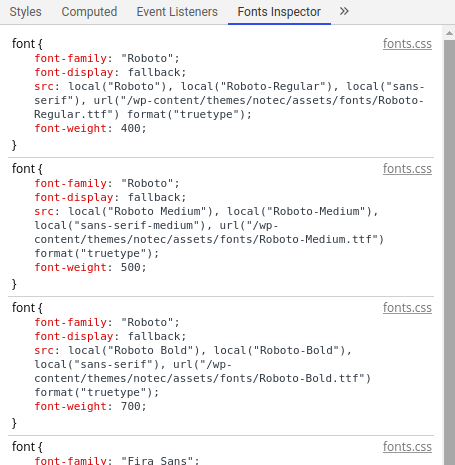

# Fonts Inspector

It searches for all registered fonts (@font-face rules) in external stylesheets and style elements in the DOM. Clicking on the filename opens Sources tab or inspects the element

## How to install

Currently the extension is **NOT** in the Chrome Web Store. To use, clone the repo, generate frontend (`cd frontend && npm run build`) and [install the extension in developer mode](https://developer.chrome.com/extensions/getstarted#manifest)  